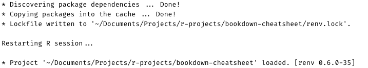

# Cheatsheet {#cheatsheet}


## Create a Bookdown

1. Make a new repo on GitHub
1. Create a new project in RStudio: *File > New Project... > Version Control > Git*
1. Run `bookdown:::bookdown_skeleton(getwd())` in the Console.

## Using `renv` inside a Bookdown with GitHub

### Loading two libraries to use as examples

```{r warning = FALSE, message = FALSE}
library(tidyverse) # installed via CRAN
library(gt) # installed via GitHub
```

### Install/load `renv`

```r
if (!requireNamespace("remotes"))
  install.packages("remotes")

remotes::install_github("rstudio/renv")
```

```{r warning = FALSE, message = FALSE}
library(renv)
```

### What R packages are used in this Bookdown?

```{r}
renv::dependencies() %>% 
  pull(Package) %>% 
  unique()
```

### 1 - Create the initial lockfile

I ran this in my Console...

```r
renv::init()
```

...which outputted this:

```{r echo = FALSE, out.width = "80%"}

```

This added three new files:

```{r echo = FALSE, out.width = "80%"}

```

* `.Rprofile`
  + Used by the `renv` package
  + I added `.Rprofile` to my `.gitignore` file
* `renv/`
  + Used by the `renv` package
* `renv.lock`
  + The lockfile - contains information about the packages used, what they are and how they were installed


### 2 - Take a snapshot of the current Bookdown package library

I ran this is my Console:

```r
renv::snapshot()
```

Since I have not used any new packages in my Bookdown since `renv.lock` was last updated (i.e. when it was initially created), nothing happened. I saw this output:

```r
* The lockfile is already up to date.
```

If I use a new package somewhere in the Bookdown, such as `testthat` (which I already have installed locally), a message pops up saying "Package testthat required but is not installed."

When I installed it via `install.packages("testthat")`, the package is automatically added to `renv.lock`:

```{r echo = FALSE, out.width = "80%"}

```


